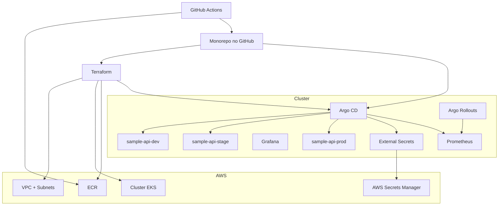

# Arquitetura

## Objetivos

- Git é a fonte da verdade para estado de plataforma e workloads.
- Terraform provisiona infraestrutura AWS e dependências de bootstrap.
- Argo CD executa reconciliação declarativa a partir do Git.
- Argo Rollouts executa entrega progressiva com promoção/abort orientados por métricas.
- CI gera artefatos e mudanças em Git apenas; CD acontece no cluster via Argo CD.

## Topologia



## Modelo operacional do Argo CD

Este repositório usa **App of Apps** como plano de controle principal:

- `root-app`: controla AppProjects e Applications filhas.
- `platform`: instala manifests compartilhados de plataforma.
- `workloads-dev`, `workloads-stage`, `workloads-prod`: deploy dos overlays de ambiente.

Por que App of Apps:

- limites de ambiente e responsabilidade explicita
- ordenação determinística de sync (sync waves)
- auditoria e governança mais simples

A pasta `argocd/applicationsets/` fica disponível para expansão futura opcional, mas o baseline em produção é App of Apps.

## Modelo de sync e governança

- aplicações `dev` e `stage`: auto-sync + self-heal.
- aplicação `prod`: somente sync manual, limitada por sync window no AppProject.
- timezone da janela de sync em `prod`: `America/Sao_Paulo`.
- AppProjects restringem namespaces de destino e definem papéis por time.

## Modelo de entrega progressiva

- workload base usa Argo Rollout (não Deployment).
- stage e prod usam canary por padrão.
- prod pode alternar para blue/green com `kustomization.bluegreen.yaml`.
- gates de análise consultam Prometheus para:
  - taxa de sucesso / proteção de 5xx
  - latência p95
  - SLI de readiness
- análise com falha aborta rollout automaticamente.

## Decisão de ingress

AWS Load Balancer Controller (ALB) foi escolhido em vez de NGINX porque:

- integração nativa com AWS e balanceamento L7 gerenciado
- compatibilidade direta com traffic routing do Argo Rollouts
- menor overhead operacional para um baseline EKS nativo

## Árvore de diretórios

```text
.
|-- terraform/
|   |-- modules/{vpc,eks,ecr,addons}
|   `-- environments/{dev,stage,prod}
|-- bootstrap/argocd-bootstrap/
|-- argocd/
|   |-- root-app/
|   |-- projects/
|   |-- applications/
|   `-- applicationsets/
|-- platform/
|   |-- overlays/shared/
|   |-- namespaces/base/
|   |-- argocd/base/
|   |-- argo-rollouts/base/
|   |-- external-secrets/base/
|   |-- monitoring/base/
|   |-- ingress/base/
|   `-- policies/kyverno/base/
|-- apps/sample-api/
|   |-- app/
|   |-- base/
|   `-- overlays/{dev,stage,prod}
|-- environments/{dev,stage,prod}
|-- .github/workflows/
|-- github-actions/scripts/
|-- scripts/
`-- docs/
```

